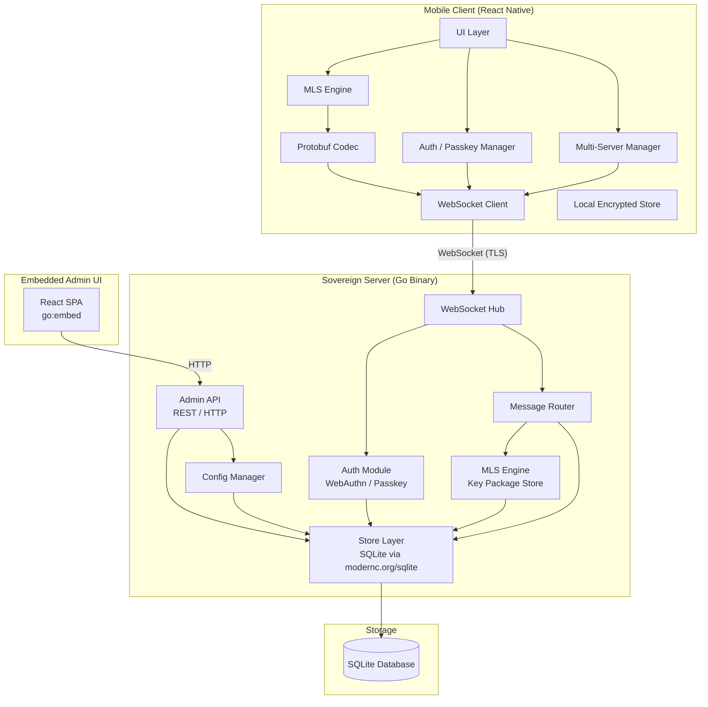
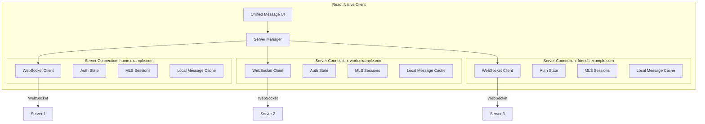

# System Architecture

## Overview

Sovereign is a privacy-focused, self-hosted messaging application. It is composed of three primary components:

1. **Go Server** — A single statically-linked binary (pure Go, no CGo) that handles authentication, message routing, encryption coordination, persistent storage, and serves an embedded admin UI. It uses `modernc.org/sqlite` for its database, ensuring zero native dependencies.

2. **React Native Mobile Client** — A cross-platform (iOS/Android) application that connects to one or more Sovereign servers simultaneously. The client is responsible for key management, MLS encryption/decryption, and presenting a unified messaging experience across multiple servers.

3. **Embedded Admin UI** — A React-based single-page application bundled into the server binary via `go:embed`. It provides server operators with a browser-based dashboard for user management, server configuration, and monitoring.

---

## Component Diagram



---

## Server Architecture

The server is organized as a standard Go project with clear separation of concerns.

### Directory Structure

```
sovereign/
├── cmd/
│   ├── sovereign/          # Main server entry point
│   │   └── main.go         # Starts HTTP/WebSocket server, loads config, initializes all subsystems
│   └── sovereign-cli/      # CLI setup wizard
│       └── main.go         # Interactive setup: create config, initialize DB, register admin
├── internal/
│   ├── config/             # Configuration loading, validation, defaults
│   │   └── config.go       # Reads config file, env vars, provides typed config struct
│   ├── auth/               # WebAuthn/Passkey authentication
│   │   ├── webauthn.go     # Challenge generation, credential verification
│   │   └── session.go      # Session token creation, validation, expiry
│   ├── ws/                 # WebSocket connection management
│   │   ├── hub.go          # Connection registry, broadcast, per-user routing
│   │   ├── conn.go         # Single connection handler, read/write pumps
│   │   └── upgrade.go      # HTTP → WebSocket upgrade with auth
│   ├── protocol/           # Protocol Buffers message definitions and handling
│   │   ├── envelope.go     # Envelope wrapping/unwrapping
│   │   └── handler.go      # Message type dispatch
│   ├── mls/                # MLS-related server-side logic
│   │   ├── keypackage.go   # Key package upload, retrieval, consumption
│   │   └── group.go        # Group state tracking (server-side metadata only)
│   ├── store/              # Database access layer
│   │   ├── db.go           # SQLite connection setup, migrations
│   │   ├── user.go         # User CRUD
│   │   ├── message.go      # Message storage and retrieval
│   │   ├── credential.go   # WebAuthn credential storage
│   │   ├── session.go      # Session storage
│   │   └── conversation.go # Conversation and membership management
│   ├── admin/              # Admin API handlers
│   │   ├── routes.go       # Admin HTTP route registration
│   │   ├── users.go        # User management endpoints
│   │   ├── settings.go     # Server settings endpoints
│   │   └── dashboard.go    # Dashboard stats endpoint
│   └── wizard/             # Setup wizard logic (used by sovereign-cli)
│       └── wizard.go       # Interactive prompts, config generation, DB init
├── web/                    # Embedded admin UI
│   ├── embed.go            # go:embed directives for static assets
│   └── admin/              # Built React SPA (HTML, JS, CSS)
│       ├── index.html
│       └── assets/
├── proto/                  # Protobuf definitions
│   └── sovereign.proto     # Message envelope, auth messages, MLS messages
├── go.mod
├── go.sum
└── sovereign.db            # SQLite database (created at runtime)
```

### Package Responsibilities

| Package | Responsibility |
|---------|---------------|
| `cmd/sovereign` | Entry point. Parses flags, loads config, initializes the store, starts the WebSocket server and HTTP server (for admin UI), handles graceful shutdown. |
| `cmd/sovereign-cli` | Interactive CLI wizard for first-time setup. Creates config file, initializes database schema, registers the admin user with a passkey. |
| `internal/config` | Loads configuration from a TOML/JSON file and environment variables. Provides a strongly-typed `Config` struct used throughout the server. |
| `internal/auth` | Implements the WebAuthn/Passkey registration and authentication flows. Issues and validates session tokens (opaque random tokens, stored hashed). |
| `internal/ws` | Manages WebSocket connections. The `Hub` tracks all active connections indexed by user ID. Handles upgrading HTTP connections, read/write goroutine pumps, ping/pong keepalives, and graceful disconnect. |
| `internal/protocol` | Defines the protobuf-based protocol envelope. Handles serialization/deserialization of messages, dispatches incoming messages to the appropriate handler based on message type. |
| `internal/mls` | Server-side MLS support. Stores and serves key packages for users. Tracks group metadata (which conversation maps to which MLS group). The server never holds private key material. |
| `internal/store` | Data access layer over SQLite. All database queries are centralized here. Handles schema migrations on startup. Uses `modernc.org/sqlite` for a pure-Go SQLite driver. |
| `internal/admin` | HTTP handlers for the admin API. Protected by admin-role session authentication. Serves user management, server settings, and dashboard statistics. |
| `internal/wizard` | Shared logic for the setup wizard. Used by `sovereign-cli`. Handles interactive prompts, config file generation, database initialization, and admin user registration. |
| `web` | Contains the `go:embed` directive that bundles the pre-built admin React SPA into the server binary. The embedded filesystem is served by the HTTP handler at `/admin`. |

### Server Startup Sequence

1. Parse command-line flags and locate config file.
2. Load and validate configuration.
3. Open SQLite database and run migrations.
4. Initialize the auth module with WebAuthn configuration.
5. Initialize the WebSocket hub.
6. Initialize the message router and connect it to the hub and store.
7. Register admin API HTTP routes and mount embedded admin UI.
8. Start the HTTP server (serves both WebSocket upgrades and admin UI).
9. Block on OS signal (SIGINT/SIGTERM) for graceful shutdown.

---

## Message Data Flow

The following describes the complete lifecycle of a message from sender to recipient.

### Step 1: Client Composes and Encrypts

```
User types message
    │
    ▼
Client serializes plaintext message into a protobuf `MessageContent`
    │
    ▼
Client encrypts `MessageContent` bytes using the MLS group session
    → Produces MLS ciphertext (encrypted for all group members)
    │
    ▼
Client wraps the MLS ciphertext in a protobuf `Envelope`
    → Envelope contains: type=MESSAGE, conversation_id, sender_id, ciphertext, client_timestamp
    │
    ▼
Client serializes the `Envelope` to bytes and sends over WebSocket
```

### Step 2: Server Receives and Routes

```
WebSocket Hub receives raw bytes from sender's connection
    │
    ▼
Deserialize bytes into `Envelope` protobuf
    │
    ▼
Validate sender's session (connection is pre-authenticated at upgrade time)
    │
    ▼
Verify sender is a member of the specified conversation
    │
    ▼
Assign server_timestamp (monotonic, unix epoch nanoseconds)
Assign server-generated message ID (UUID)
    │
    ▼
Store encrypted message to SQLite:
    INSERT INTO message (id, conversation_id, sender_id, encrypted_payload, server_timestamp)
    │
    ▼
Look up all members of the conversation in ConversationMember
    │
    ▼
For each member with an active WebSocket connection:
    → Serialize the `Envelope` (now with server_timestamp and message_id)
    → Write to that member's WebSocket connection
    │
For members without an active connection:
    → Message is stored; delivered when they reconnect and sync
```

### Step 3: Recipient Receives and Decrypts

```
Recipient's WebSocket connection receives raw bytes
    │
    ▼
Deserialize bytes into `Envelope` protobuf
    │
    ▼
Extract MLS ciphertext from the Envelope
    │
    ▼
Decrypt ciphertext using the MLS group session
    → Produces plaintext `MessageContent` bytes
    │
    ▼
Deserialize `MessageContent` protobuf
    │
    ▼
Display message in the conversation UI
    │
    ▼
Send delivery acknowledgment back to server (optional, for read receipts)
```

### Offline Message Delivery

When a client reconnects after being offline, it performs a sync:

1. Client sends a `SyncRequest` with the `last_seen_server_timestamp` for each conversation.
2. Server queries `SELECT * FROM message WHERE conversation_id = ? AND server_timestamp > ? ORDER BY server_timestamp ASC`.
3. Server streams the missed messages to the client over WebSocket.
4. Client decrypts and displays each message in order.

---

## Authentication Flow

Sovereign uses Passkey/WebAuthn for passwordless authentication. There are no passwords anywhere in the system.

### Registration Flow

```
┌──────────┐                          ┌──────────┐
│  Client   │                          │  Server   │
└─────┬────┘                          └─────┬────┘
      │                                      │
      │  1. POST /auth/register/begin        │
      │  { username, display_name }          │
      │─────────────────────────────────────▶│
      │                                      │  2. Generate challenge
      │                                      │     Store challenge in memory (TTL 60s)
      │  3. Return PublicKeyCredentialCreationOptions
      │◀─────────────────────────────────────│
      │                                      │
      │  4. navigator.credentials.create()   │
      │     User performs biometric/PIN       │
      │                                      │
      │  5. POST /auth/register/finish       │
      │  { attestation response }            │
      │─────────────────────────────────────▶│
      │                                      │  6. Verify attestation
      │                                      │     Create User record
      │                                      │     Store Credential (public key, credential ID)
      │                                      │     Create Session
      │  7. Return { session_token, user }   │
      │◀─────────────────────────────────────│
      │                                      │
      │  8. Client stores session token      │
      │     Connects WebSocket with token    │
```

### Login Flow

```
┌──────────┐                          ┌──────────┐
│  Client   │                          │  Server   │
└─────┬────┘                          └─────┬────┘
      │                                      │
      │  1. POST /auth/login/begin           │
      │  { username }                        │
      │─────────────────────────────────────▶│
      │                                      │  2. Look up user's credentials
      │                                      │     Generate challenge
      │  3. Return PublicKeyCredentialRequestOptions
      │     (includes allowCredentials list) │
      │◀─────────────────────────────────────│
      │                                      │
      │  4. navigator.credentials.get()      │
      │     User performs biometric/PIN       │
      │                                      │
      │  5. POST /auth/login/finish          │
      │  { assertion response }              │
      │─────────────────────────────────────▶│
      │                                      │  6. Verify assertion signature
      │                                      │     Update sign_count
      │                                      │     Create Session
      │  7. Return { session_token, user }   │
      │◀─────────────────────────────────────│
      │                                      │
      │  8. Client stores session token      │
      │     Connects WebSocket with token    │
```

### Session Management

- Session tokens are cryptographically random (32 bytes, base64url-encoded).
- Tokens are stored **hashed** (SHA-256) in the database. The server never stores the raw token.
- Sessions have a configurable expiry (default: 30 days).
- `last_seen_at` is updated on each WebSocket message to enable idle session cleanup.
- WebSocket connections include the session token as a query parameter during the upgrade handshake: `wss://server:8080/ws?token=<session_token>`.

---

## Multi-Server Client Architecture

A key feature of Sovereign is that a single mobile client can connect to multiple independent Sovereign servers simultaneously.

### Architecture



### Design Details

- **Separate WebSocket connections**: Each server gets its own independent WebSocket connection. Connections are managed by the `ServerManager`, which handles reconnection, backoff, and lifecycle.
- **Per-server auth state**: Each server connection maintains its own session token, stored securely in the device keychain. Passkey credentials may differ per server (the user might register different passkeys on different servers).
- **Per-server MLS state**: MLS group sessions are scoped to a single server. Key material, epoch state, and group membership are isolated per server.
- **Unified message stream**: The UI presents a single conversation list that aggregates conversations across all connected servers. Each conversation is tagged with its server origin. Messages from different servers are interleaved in the unified view by timestamp.
- **Server selector UI**: The app provides a server sidebar or tab bar that lets users filter conversations by server, view server-specific settings, and manage server connections (add, remove, reconnect).
- **Offline resilience**: Each server connection operates independently. If one server is offline, conversations on other servers remain fully functional. Reconnection is handled per-server with exponential backoff.
- **Local storage**: Message caches are partitioned by server to prevent data leakage across server boundaries. Each server's data can be wiped independently.

---

## Deployment Model

Sovereign is designed for radical simplicity in deployment.

### Single Binary

The server compiles to a single statically-linked binary with zero runtime dependencies. The SQLite database is embedded via `modernc.org/sqlite` (pure Go), and the admin UI is embedded via `go:embed`. There is no need for Docker, Kubernetes, nginx, or any external database.

### Deployment Steps

1. **Download** the prebuilt binary for your platform (linux/amd64, linux/arm64, darwin/amd64, darwin/arm64).
2. **Run the setup wizard**: `./sovereign-cli setup` — creates config file, initializes database, registers admin user.
3. **Start the server**: `./sovereign` — begins listening for WebSocket and HTTP connections.
4. **Configure network access**: The user is responsible for making the server reachable from the internet:
   - Port forwarding on their router (e.g., forward external port 443 to internal port 8080).
   - Dynamic DNS or a static IP with a domain name.
   - Optional: reverse proxy (nginx/caddy) for TLS termination, though the server can also serve TLS directly with a provided certificate.
5. **Share the server URL** with users who should connect.

### Target Hardware

Sovereign is designed to run on minimal hardware:

- Raspberry Pi 4 or equivalent ARM SBC
- Old laptop or desktop repurposed as a home server
- Low-end VPS (512 MB RAM is sufficient)
- NAS devices that support running custom binaries

### Data Persistence

All state is stored in a single SQLite database file (`sovereign.db`). Backups are as simple as copying this file (with proper SQLite backup procedures, e.g., using `.backup` or ensuring WAL checkpoint).

---

## Key Design Principles

### Privacy-First

The server is architecturally unable to read message content. Messages arrive as encrypted blobs and are stored as encrypted blobs. The server has no access to MLS private keys or group session secrets. Even a fully compromised server reveals only encrypted data and metadata.

### Zero Trust

The system assumes the server may be compromised. End-to-end encryption via MLS (RFC 9420) ensures that message confidentiality does not depend on server integrity. Forward secrecy ensures that compromise of current keys does not retroactively expose past messages. Post-compromise security ensures that after a compromise is resolved and keys are rotated, future messages are again secure.

### Self-Sovereignty

Users own their data and infrastructure entirely. There is no central service, no account federation, no phone number requirement, and no third-party dependency at runtime. The user's server is their own, running on their own hardware, under their own domain. If they want to stop, they shut down the binary and delete the database file.

### Simplicity

The entire server is a single binary. The entire database is a single file. Setup is an interactive CLI wizard. There is no configuration management, no container orchestration, no microservices. This is deliberate: the target user is someone who can forward a port on their router, not someone who manages Kubernetes clusters.

### Minimal Metadata

While v1 necessarily exposes some metadata to the server (who talks to whom, when, message sizes), the architecture is designed to minimize this exposure. Message content is always encrypted. Future versions may introduce padding, traffic shaping, and other metadata-reduction techniques. The threat model document covers this in detail.
