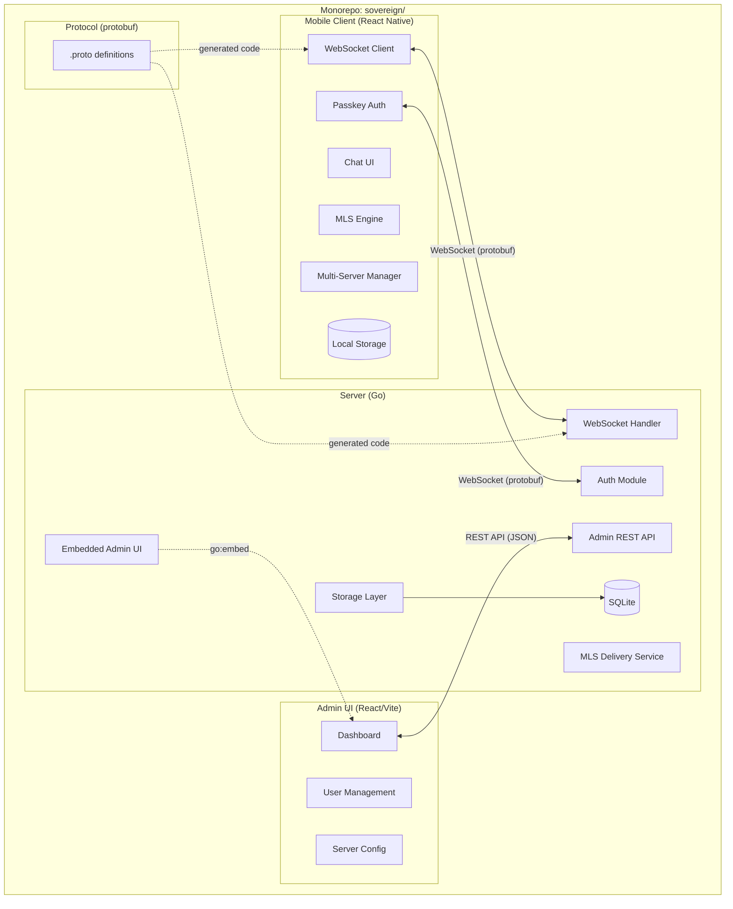

# RFC-0001: Project Architecture

- **Status**: Accepted
- **Author**: architect
- **Created**: 2026-02-16
- **Updated**: 2026-02-16
- **Review**: Human

## Summary

This RFC defines the high-level architecture of Sovereign, a privacy-focused self-hosted messaging application. It establishes the three main components (server, mobile client, admin UI), their boundaries, communication patterns, and the protocol layer that serves as the contract between them.

## Motivation

Sovereign needs a clear architectural foundation before implementation begins. The architecture must support:

- **Privacy by design**: End-to-end encryption where the server never sees plaintext.
- **Self-hosted simplicity**: Single binary deployment with no external dependencies.
- **Cross-platform mobile**: One codebase for iOS and Android.
- **Extensibility**: Clean component boundaries that allow independent evolution.

A well-defined architecture ensures that each component can be developed, tested, and reasoned about independently while maintaining strong integration guarantees through shared protocol definitions.

## Detailed Design

### Component Overview

Sovereign consists of three main components and a shared protocol layer:



### 1. Server (`server/`)

The Go server is the central hub responsible for:

- **WebSocket gateway**: Accepts and manages persistent WebSocket connections from mobile clients.
- **Authentication**: Handles WebAuthn/passkey registration and authentication ceremonies.
- **MLS delivery service**: Stores and forwards encrypted MLS messages, key packages, Welcome messages, and Commits. The server never decrypts message content.
- **Message storage**: Persists encrypted message blobs in SQLite for offline delivery and history sync.
- **Admin API**: Exposes a REST API for server administration (user management, server configuration, monitoring).
- **Embedded admin UI**: Serves the admin web panel from embedded static files.

The server produces a single binary with no external runtime dependencies. SQLite is embedded (via modernc.org/sqlite), and the admin UI is embedded (via `go:embed`).

**Internal structure:**

```
server/
├── main.go              # Entry point, server startup
├── config/              # Configuration loading
├── auth/                # WebAuthn authentication
├── ws/                  # WebSocket connection management
├── mls/                 # MLS delivery service logic
├── storage/             # SQLite storage layer
├── admin/               # Admin REST API handlers
├── web/dist/            # Embedded admin UI (build artifact)
└── migrate/             # Database migrations
```

### 2. Mobile Client (`mobile/`)

The React Native mobile client is the primary user-facing application:

- **Chat interface**: Conversation list, message threads, media display.
- **MLS engine**: Client-side MLS state management — group creation, key rotation, message encryption/decryption.
- **WebSocket client**: Persistent connection to the server with reconnection logic.
- **Passkey authentication**: Platform WebAuthn integration for registration and login.
- **Multi-server manager**: Manages connections to multiple independent Sovereign servers simultaneously.
- **Local storage**: Encrypted local database for messages, contacts, and MLS state.

**Internal structure:**

```
mobile/
├── src/
│   ├── screens/         # React Native screens
│   ├── components/      # Reusable UI components
│   ├── services/        # WebSocket, auth, MLS services
│   ├── stores/          # State management
│   ├── native/          # Native module bridges (MLS, keychain)
│   └── proto/           # Generated protobuf TypeScript types
├── ios/                 # iOS native project
├── android/             # Android native project
└── package.json
```

### 3. Admin UI (`admin-ui/`)

A React/Vite single-page application for server administration:

- **Dashboard**: Server health, connection counts, storage usage.
- **User management**: View users, revoke sessions, manage roles.
- **Server configuration**: Retention policies, rate limits, registration settings.

The admin UI is built to static files and embedded into the server binary via `go:embed`. It communicates with the server via a REST API on the same origin.

**Internal structure:**

```
admin-ui/
├── src/
│   ├── pages/           # Admin pages
│   ├── components/      # UI components
│   ├── api/             # REST API client
│   └── auth/            # WebAuthn admin authentication
├── vite.config.ts
└── package.json
```

### 4. Protocol Layer (`proto/`)

Protocol Buffer definitions that serve as the contract between server and client:

```
proto/
├── envelope.proto       # Top-level WebSocket message wrapper
├── auth.proto           # Authentication messages
├── messaging.proto      # Chat messages, delivery receipts
├── mls.proto            # MLS key packages, Commits, Welcome
├── admin.proto          # Admin API messages
└── common.proto         # Shared types (timestamps, IDs)
```

Generated code is output to:
- `server/proto/` (Go)
- `mobile/src/proto/` (TypeScript)

### Communication Patterns

| Path | Transport | Format | Purpose |
|------|-----------|--------|---------|
| Mobile <-> Server | WebSocket (WSS) | Protocol Buffers (binary frames) | Real-time messaging, auth, MLS operations |
| Admin UI <-> Server | REST API (HTTPS) | JSON | Server administration |
| Admin UI -> Server | `go:embed` | Static files | Admin UI delivery (no network, same binary) |

### Trust Levels

| Component | Trust Level | Sees Plaintext? | Holds Private Keys? |
|-----------|------------|-----------------|---------------------|
| Server | Semi-trusted | No | No (only public keys for WebAuthn) |
| Mobile Client | Fully trusted | Yes (local only) | Yes (MLS private keys, passkey private key in secure enclave) |
| Admin UI | Trusted (admin role) | No | No (admin passkey in browser/platform) |

The server is explicitly designed as a **semi-trusted** component. It facilitates communication but cannot read message content, forge group operations, or impersonate users.

## Security Considerations

- **Component isolation**: The server never has access to MLS private keys or plaintext message content. The security of E2E encryption does not depend on server integrity.
- **Admin UI isolation**: The admin UI runs in a browser sandbox. It can manage server configuration and users but cannot access encrypted message content.
- **Protocol as contract**: The protobuf definitions enforce type-safe communication. Any protocol change requires updating the shared definitions, making breaking changes visible.
- **Single origin for admin**: The admin UI and API share an origin, eliminating CSRF and CORS attack surface for admin operations.
- **Build-time embedding**: The admin UI is fixed at build time. A compromised server process cannot modify the admin UI files (they are in read-only embedded data).

## Alternatives Considered

- **Microservices architecture**: Splitting the server into separate services (auth, messaging, admin). Rejected as over-engineering for a single-server application. Adds operational complexity (service discovery, inter-service auth) without benefit at this scale.
- **Shared database between mobile and server**: Having the mobile client directly access the server's SQLite database (e.g., via Litestream replication). Rejected because it breaks the privacy boundary — the server's database contains metadata that should not be fully replicated to clients.
- **GraphQL for admin API**: Flexible querying for the admin UI. Rejected in favor of REST for simplicity. The admin API surface is small and well-defined; REST is sufficient.

## Open Questions

- **Push notifications**: How will the server notify mobile clients that are not currently connected? Likely via platform push notification services (APNs, FCM), but the design for this is deferred.
- **Media handling**: How will file/image attachments be handled? Likely client-side encrypted and uploaded as blobs, but the detailed design is deferred.
- **Plugin/extension system**: Should the server support plugins for custom behavior? Deferred to a future RFC if needed.

## References

- [ADR-0001: Monorepo Structure](../adrs/0001-monorepo-structure.md)
- [ADR-0002: Go for Server](../adrs/0002-go-for-server.md)
- [ADR-0003: React Native for Mobile](../adrs/0003-react-native-for-mobile.md)
- [ADR-0004: SQLite for Database](../adrs/0004-sqlite-for-database.md)
- [ADR-0008: Embedded Admin UI](../adrs/0008-embedded-admin-ui.md)
