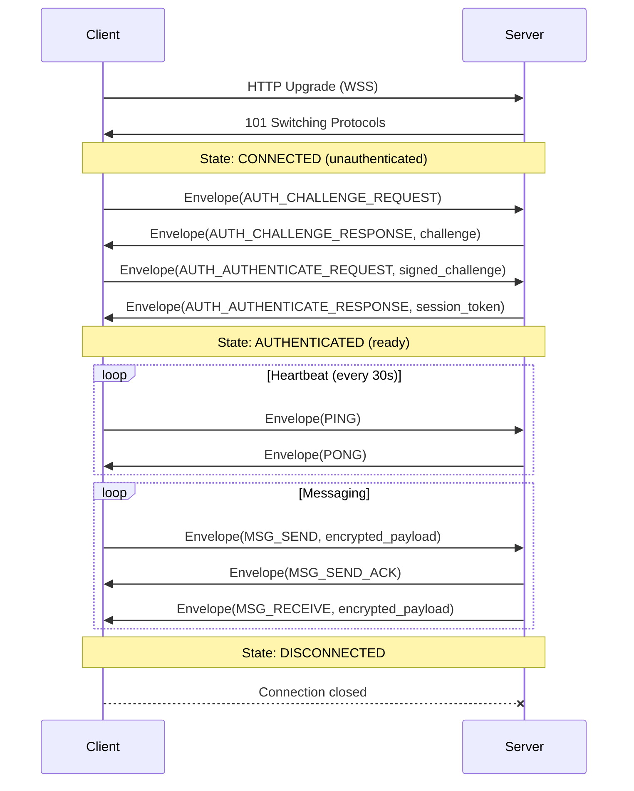
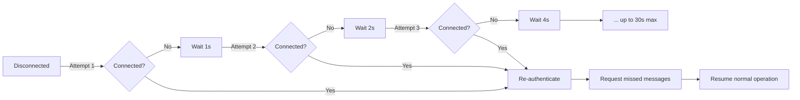

# RFC-0002: WebSocket Protocol

- **Status**: Accepted
- **Author**: architect
- **Created**: 2026-02-16
- **Updated**: 2026-02-16
- **Review**: Human

## Summary

This RFC defines the WebSocket protocol used for real-time communication between Sovereign mobile clients and the server. It covers envelope-based message framing with Protocol Buffers, the MessageType system, request-response correlation, connection lifecycle, reconnection strategy, message ordering, rate limiting, and error handling.

## Motivation

The WebSocket transport (ADR-0006) needs a well-defined application-level protocol on top of it. Without a structured protocol, we would face issues with:

- Message type disambiguation (how does the receiver know what kind of message it received?)
- Request-response correlation (how does a client match a server response to its original request?)
- Connection lifecycle (when is a connection ready for messaging vs. still authenticating?)
- Error handling (how are errors communicated back to the sender?)
- Ordering guarantees (how do clients order messages from different senders?)

This RFC establishes the protocol that all WebSocket communication in Sovereign follows.

## Detailed Design

### Envelope-Based Framing

All WebSocket messages are binary frames containing a serialized Protocol Buffer `Envelope` message:

```protobuf
syntax = "proto3";

message Envelope {
  string request_id = 1;       // Client-generated UUID for request-response correlation
  MessageType type = 2;        // Discriminator for the payload
  bytes payload = 3;           // Serialized inner message (type-specific)
  int64 server_timestamp = 4;  // Server-assigned timestamp (Unix micros), 0 on client-sent
  string error_code = 5;       // Non-empty if this is an error response
  string error_message = 6;    // Human-readable error description
}

enum MessageType {
  MESSAGE_TYPE_UNSPECIFIED = 0;

  // Authentication
  AUTH_CHALLENGE_REQUEST = 1;
  AUTH_CHALLENGE_RESPONSE = 2;
  AUTH_AUTHENTICATE_REQUEST = 3;
  AUTH_AUTHENTICATE_RESPONSE = 4;

  // Messaging
  MSG_SEND = 10;
  MSG_SEND_ACK = 11;
  MSG_RECEIVE = 12;
  MSG_DELIVERY_RECEIPT = 13;
  MSG_READ_RECEIPT = 14;
  MSG_HISTORY_REQUEST = 15;
  MSG_HISTORY_RESPONSE = 16;

  // MLS Key Management
  MLS_KEY_PACKAGE_UPLOAD = 20;
  MLS_KEY_PACKAGE_FETCH = 21;
  MLS_KEY_PACKAGE_RESPONSE = 22;
  MLS_WELCOME = 23;
  MLS_COMMIT = 24;
  MLS_GROUP_MESSAGE = 25;

  // Connection Management
  PING = 30;
  PONG = 31;

  // Error
  ERROR = 40;
}
```

### Request-Response Correlation

For request-response pairs, the client generates a UUID `request_id` and includes it in the request envelope. The server echoes the same `request_id` in the response envelope. This allows the client to match responses to pending requests, even when multiple requests are in flight.

```
Client                          Server
  |                                |
  |-- Envelope(request_id=A, AUTH_CHALLENGE_REQUEST) -->|
  |-- Envelope(request_id=B, MSG_HISTORY_REQUEST) ----->|
  |                                |
  |<- Envelope(request_id=B, MSG_HISTORY_RESPONSE) -----|  (response B arrives first)
  |<- Envelope(request_id=A, AUTH_CHALLENGE_RESPONSE) --|  (response A arrives second)
```

Server-initiated messages (e.g., incoming messages, MLS operations pushed to clients) have an empty `request_id`.

### Connection Lifecycle



**Connection states:**

| State | Description | Allowed Messages |
|-------|-------------|-----------------|
| `CONNECTED` | WebSocket open, not yet authenticated | `AUTH_CHALLENGE_REQUEST` only |
| `AUTHENTICATED` | Authentication complete | All message types |
| `DISCONNECTED` | Connection closed | None |

The server enforces state transitions. Any message sent in the wrong state receives an `ERROR` response and the connection is closed.

**Timeouts:**
- Authentication must complete within 10 seconds of WebSocket connection, or the server closes the connection.
- If no PING is received within 90 seconds (3 missed heartbeat intervals), the server considers the connection dead and closes it.

### Message Ordering

Messages are ordered by `server_timestamp`, which is assigned by the server when it processes the message. This provides a global ordering across all clients.

- The server uses monotonic microsecond timestamps to ensure uniqueness.
- Clients display messages ordered by `server_timestamp`.
- For messages within the same conversation, `server_timestamp` defines the canonical order.
- Client-local "optimistic" messages are displayed immediately but reordered when the server-assigned timestamp arrives via `MSG_SEND_ACK`.

### Reconnection Strategy

When a WebSocket connection drops, the client reconnects with exponential backoff:



- **Base delay**: 1 second
- **Backoff multiplier**: 2x
- **Maximum delay**: 30 seconds
- **Jitter**: +/- 20% random jitter to prevent thundering herd
- **On successful reconnect**: Re-authenticate, then request messages since the last received `server_timestamp`.

### Rate Limiting

The server enforces per-connection rate limits:

| Message Type | Rate Limit | Burst |
|-------------|------------|-------|
| MSG_SEND | 10/second | 20 |
| MLS_COMMIT | 2/second | 5 |
| MLS_KEY_PACKAGE_UPLOAD | 1/second | 3 |
| MSG_HISTORY_REQUEST | 2/second | 5 |
| PING | 1/second | 2 |

When a rate limit is exceeded, the server responds with an `ERROR` envelope:

```protobuf
Envelope {
  request_id: "<original_request_id>"
  type: ERROR
  error_code: "RATE_LIMITED"
  error_message: "Rate limit exceeded for MSG_SEND. Retry after 1.2s"
}
```

### Error Handling

Errors are communicated via the `error_code` and `error_message` fields on the `Envelope`:

| Error Code | Description | Action |
|-----------|-------------|--------|
| `AUTH_REQUIRED` | Message sent before authentication | Client must authenticate |
| `AUTH_FAILED` | Authentication ceremony failed | Show error, allow retry |
| `RATE_LIMITED` | Rate limit exceeded | Retry after backoff |
| `INVALID_MESSAGE` | Malformed envelope or payload | Log and discard |
| `INTERNAL_ERROR` | Server error | Retry with backoff |
| `NOT_FOUND` | Requested resource not found | Handle gracefully |
| `FORBIDDEN` | Insufficient permissions | Show error |

For unrecoverable errors (e.g., repeated `AUTH_FAILED`), the server closes the WebSocket connection with an appropriate close code.

## Security Considerations

- **TLS required**: All WebSocket connections must use WSS (WebSocket over TLS). The server should reject non-TLS upgrade requests.
- **Authentication before messaging**: The server enforces that no messaging operations are allowed until authentication completes. Messages sent before auth receive `AUTH_REQUIRED` and the connection is closed.
- **Message size limits**: The server enforces a maximum envelope size of 256 KB. Messages exceeding this are rejected with `INVALID_MESSAGE`. This prevents memory exhaustion attacks.
- **Binary frames only**: The server rejects text WebSocket frames. All communication uses binary frames with protobuf serialization.
- **Request ID validation**: Request IDs must be valid UUIDs. The server rejects envelopes with invalid or excessively long request IDs.
- **Server timestamp authority**: Only the server sets `server_timestamp`. Client-provided values in this field are ignored, preventing timestamp manipulation.

## Alternatives Considered

- **JSON over WebSocket**: Human-readable but larger payloads, slower serialization, and no schema enforcement. Protobuf provides type safety, compact encoding, and forward/backward compatibility.
- **gRPC bidirectional streaming**: More structured but requires HTTP/2, which is complex on mobile and through some proxies. WebSocket is simpler and more widely supported.
- **MQTT**: Designed for IoT pub/sub, not well-suited for request-response patterns or the rich message types Sovereign needs.
- **Custom binary protocol**: Would require designing our own framing, versioning, and serialization. Protobuf already solves these problems.

## Open Questions

- **Compression**: Should we enable WebSocket per-message compression (permessage-deflate)? It reduces bandwidth but adds CPU overhead and can have security implications (CRIME-style attacks on encrypted content). Since our payloads are already encrypted (and thus high-entropy), compression would provide minimal benefit.
- **Message priorities**: Should certain message types (e.g., PING/PONG) be prioritized over others in the send queue? Currently all messages are FIFO.
- **Binary vs. text request IDs**: UUIDs as strings are human-readable but add 36 bytes per envelope. A 16-byte binary UUID would be more compact. Current decision: string for debuggability.

## References

- [ADR-0006: WebSocket Transport](../adrs/0006-websocket-transport.md)
- [RFC 6455: The WebSocket Protocol](https://tools.ietf.org/html/rfc6455)
- [Protocol Buffers Language Guide](https://protobuf.dev/programming-guides/proto3/)
