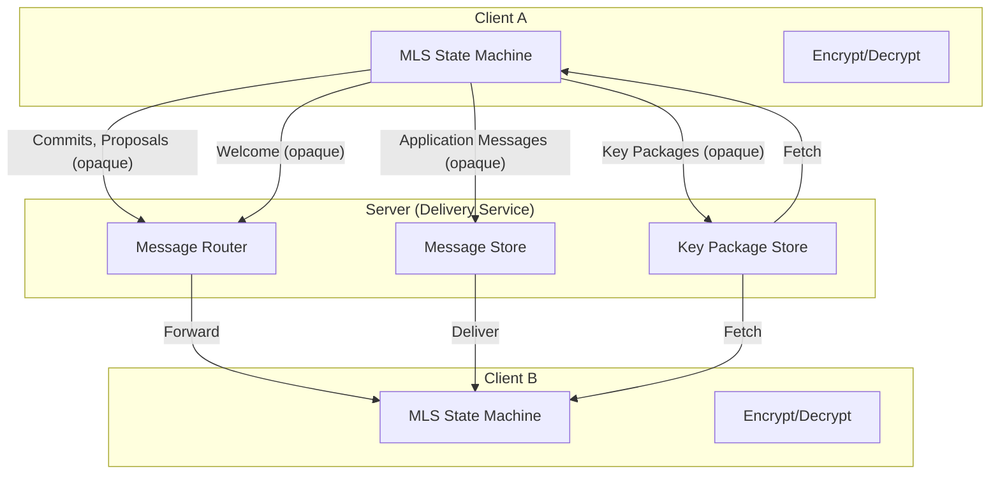
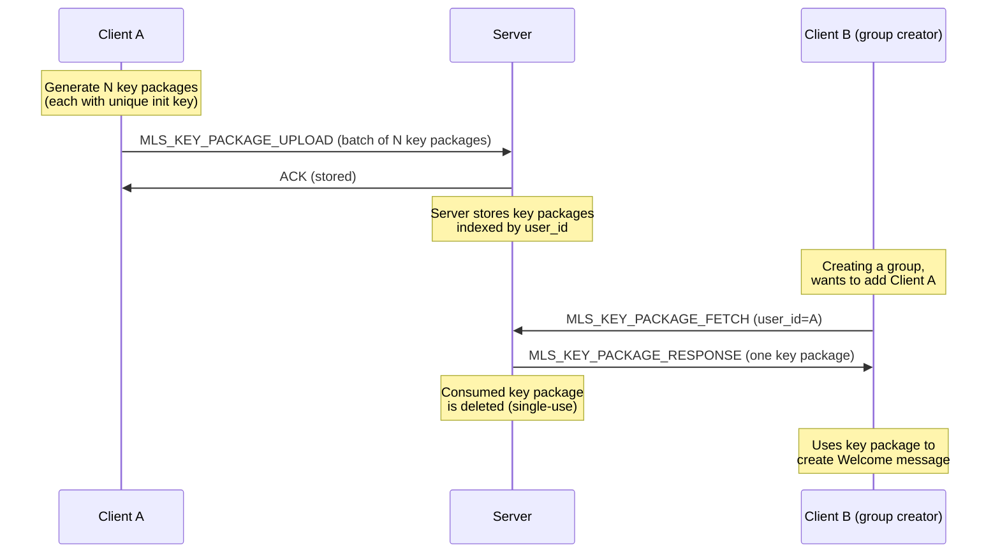
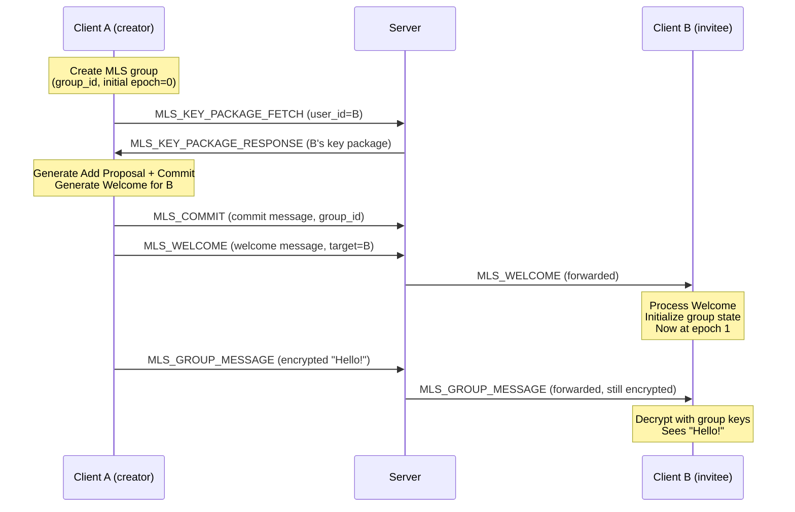

# RFC-0003: MLS Integration

- **Status**: Accepted
- **Author**: architect
- **Created**: 2026-02-16
- **Updated**: 2026-02-16
- **Review**: Human + security-engineer

## Summary

This RFC defines how the Messaging Layer Security protocol (MLS, RFC 9420) integrates with Sovereign. It covers the server's role as a delivery service, client-side MLS state management, key package lifecycle, group operations, and the security properties that result from this design.

## Motivation

Sovereign requires end-to-end encryption for all conversations (ADR-0005). MLS provides efficient group key management with forward secrecy and post-compromise security. However, MLS is a cryptographic protocol specification — it does not prescribe how to integrate with an application's transport, storage, or identity systems.

This RFC bridges that gap, defining how MLS operations map to Sovereign's WebSocket protocol, how the server facilitates key exchange without accessing plaintext, and how clients manage their local MLS state.

## Detailed Design

### Architecture: Server as Delivery Service

The Sovereign server acts as an **MLS Delivery Service (DS)** as described in the MLS architecture. It stores and forwards opaque encrypted blobs without any ability to decrypt or modify them. The server also acts as an **Authentication Service (AS)** by binding MLS credentials to WebAuthn-authenticated identities.



**What the server knows:**
- Which users are members of which groups (group_id, user_id associations).
- When messages are sent and to which groups (metadata).
- Key package blobs (opaque, cannot extract private keys).

**What the server cannot do:**
- Read message content (encrypted with group keys the server does not have).
- Forge MLS Commits or Proposals (would require the sender's private signing key).
- Silently add members (clients verify group state transitions).

### Key Package Lifecycle

Key packages are the entry point for MLS — they contain the public keys needed to add a user to a group. Each client pre-uploads key packages so that other clients can add them to groups even when they are offline.



**Key package rules:**
- Each key package is single-use. Once fetched by another client, it is deleted from the server.
- Clients maintain a pool of uploaded key packages and top up when the count drops below a threshold (e.g., replenish when fewer than 5 remain).
- Key packages are signed with the client's MLS credential (bound to their WebAuthn identity).
- The server validates the key package signature before storing it.
- Key packages have an expiration time (e.g., 30 days). Expired packages are pruned.

### Group Creation Flow



### Commit and Epoch Advancement

MLS groups advance through **epochs**. Each epoch represents a new set of group keys. Epochs advance when a **Commit** is processed. Commits can contain:

- **Add proposals**: Adding a new member.
- **Remove proposals**: Removing a member.
- **Update proposals**: A member rotating their own keys (post-compromise security).

**Commit broadcast rules:**
1. A client creates a Commit and sends it to the server.
2. The server broadcasts the Commit to all group members.
3. All members process the Commit and advance to the new epoch.
4. Messages sent after the Commit use the new epoch's keys.

**Conflict resolution**: If two clients send Commits simultaneously for the same epoch, the server accepts the first one and rejects the second with a `CONFLICT` error. The rejected client must fetch the winning Commit, update its state, and retry.

### Member Add/Remove with Key Rotation

**Adding a member:**
1. Inviter fetches the new member's key package from the server.
2. Inviter creates an Add Proposal and a Commit.
3. Inviter creates a Welcome message for the new member.
4. Server broadcasts the Commit to existing members and the Welcome to the new member.
5. All members advance to the new epoch. The new member initializes from the Welcome.

**Removing a member:**
1. Remover creates a Remove Proposal and a Commit.
2. Server broadcasts the Commit to all remaining members.
3. All remaining members advance to the new epoch.
4. The removed member can no longer decrypt messages (they lack the new epoch's keys).
5. The removed member's client detects the removal when it receives the Commit.

**Key rotation (Update):**
1. A member creates an Update Proposal (new key material) and a Commit.
2. Server broadcasts the Commit.
3. All members advance to the new epoch with the updated key material.
4. This provides **post-compromise security**: even if the member's old keys were compromised, the attacker cannot derive the new epoch's keys.

### Client-Side State Management

Each client maintains local MLS state per group:

```
LocalGroupState {
  group_id: bytes
  epoch: uint64
  ratchet_tree: RatchetTree      // The MLS tree structure
  key_schedule: KeySchedule      // Current epoch's derived keys
  pending_proposals: []Proposal  // Proposals not yet committed
  transcript_hash: bytes         // For Commit validation
}
```

**State persistence:**
- MLS group state is stored in the client's local encrypted database.
- State must be updated atomically with message processing (no partial state updates).
- If state becomes corrupted, the client can request a full group state resync (external Commit or re-joining via a new Welcome).

**Multi-device considerations:**
- Each device has its own MLS leaf in the group tree.
- A user with two devices appears as two members in the MLS group.
- Devices do not share MLS private keys.

### 1:1 Conversations

As established in ADR-0005, 1:1 conversations are modeled as MLS groups with exactly two members. There is no separate protocol for 1:1 messaging. This simplifies the codebase and ensures that 1:1 conversations have the same security properties as group conversations.

## Security Considerations

- **Forward secrecy**: MLS provides forward secrecy through epoch advancement. Compromise of current keys does not reveal messages from previous epochs. Regularly scheduled Update Commits (e.g., every 24 hours or every 100 messages) ensure frequent key rotation.

- **Post-compromise security**: After a key compromise, the compromised member (or any other member) can send an Update Commit. Once processed, the attacker loses access because they cannot derive the new epoch's keys from the old compromised keys.

- **Key package validation**: The server validates key package signatures before storing them. Clients validate key packages before using them for Add operations. This prevents the server from injecting malicious key packages.

- **Server cannot forge group operations**: Commits and Proposals are signed by the sending client's MLS credential. The server cannot create valid signatures without the client's private signing key. Clients verify all signatures when processing Commits.

- **Metadata exposure**: The server necessarily sees group membership (who is in which group) and message timing/size. This is an inherent limitation of the delivery service model. Mitigation of metadata leakage is a future consideration (e.g., padding, traffic shaping).

- **Epoch synchronization**: Clients must stay synchronized on the current epoch. If a client falls behind (e.g., offline for an extended period), it must process all missed Commits in order before it can decrypt new messages. The server maintains a Commit log per group for catch-up.

## Alternatives Considered

- **Signal Protocol (Double Ratchet)**: Well-proven for 1:1 messaging but O(n) for groups (sender encrypts for each member individually). MLS's tree-based approach is O(log n), making large groups practical. See ADR-0005 for full analysis.

- **Server-managed group keys**: The server could manage group keys, encrypting messages for each member. Rejected because this requires the server to see plaintext (or at minimum, have access to group keys), which violates the E2E principle.

- **Hybrid approach (Signal for 1:1, MLS for groups)**: Using different protocols for 1:1 and group messaging adds complexity without clear benefit. MLS handles 2-member groups efficiently, and the unified approach simplifies the codebase and security analysis.

## Open Questions

- **MLS library selection**: Which MLS library will the mobile client use? Options include OpenMLS (Rust, can be compiled for mobile via FFI), MLS++ (C++), or a custom implementation. This depends on React Native native module feasibility and will be decided during implementation.

- **Maximum group size**: What is the maximum number of members per group? MLS scales logarithmically, but very large groups (10,000+) may have practical issues with Commit size and fan-out. An initial limit of 1,000 members is proposed.

- **External Commits**: MLS supports "external Commits" that allow a new member to join a group without a Welcome from an existing member. Should Sovereign support this? It simplifies some flows but has different security properties.

- **Credential rotation**: If a user rotates their WebAuthn credential, how does this affect their MLS identity? The MLS credential should be bound to the user's server identity, not directly to a specific WebAuthn key, to allow independent rotation.

## References

- [ADR-0005: MLS over Signal Protocol](../adrs/0005-mls-over-signal-protocol.md)
- [RFC 9420: The Messaging Layer Security (MLS) Protocol](https://www.rfc-editor.org/rfc/rfc9420)
- [RFC 9420 Architecture](https://www.rfc-editor.org/rfc/rfc9420#section-2)
- [OpenMLS Library](https://openmls.tech/)
