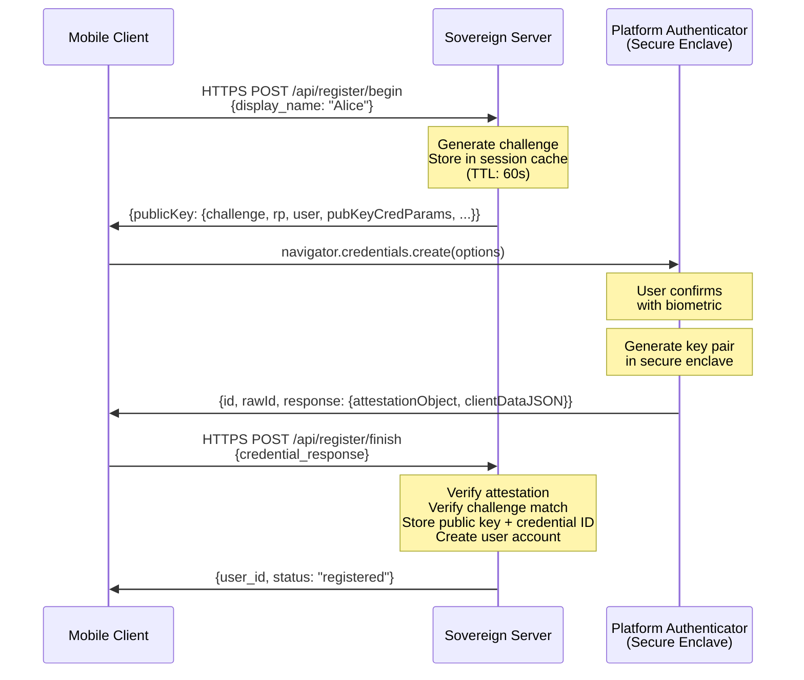
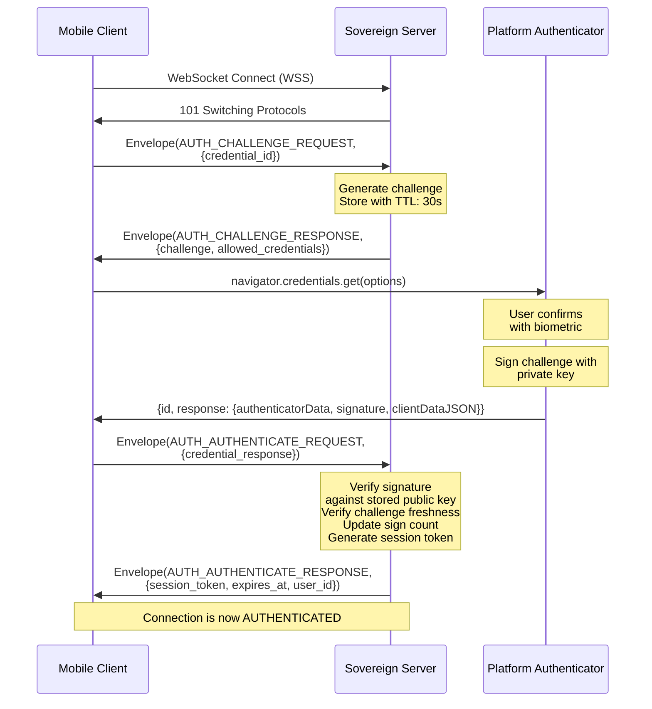
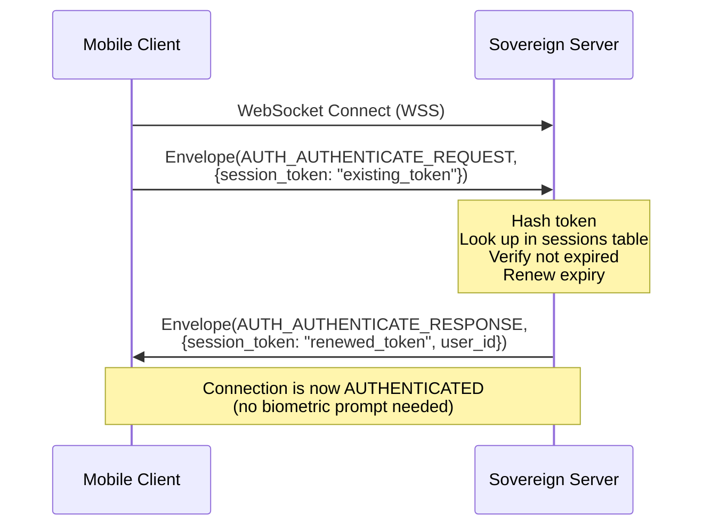

# RFC-0004: Passkey Authentication

- **Status**: Accepted
- **Author**: architect
- **Created**: 2026-02-16
- **Updated**: 2026-02-16
- **Review**: security-engineer

## Summary

This RFC defines the passkey/WebAuthn authentication flow for Sovereign, covering both the mobile client and admin panel. It details the registration ceremony, authentication ceremony, session token management, and integration with the WebSocket connection lifecycle.

## Motivation

Sovereign uses passkey/WebAuthn as its sole authentication mechanism (ADR-0007). This eliminates passwords entirely, providing phishing-resistant, hardware-backed authentication. However, WebAuthn was designed primarily for web browsers, and integrating it with a WebSocket-based messaging protocol and a React Native mobile client requires careful design.

This RFC specifies:
- How the WebAuthn ceremonies work in Sovereign's context.
- How authentication integrates with the WebSocket connection lifecycle.
- How session tokens are managed after initial authentication.
- How the admin panel authenticates separately from the messaging client.

## Detailed Design

### Server-Side Components

The server uses the `go-webauthn/webauthn` Go library for WebAuthn operations. The authentication module manages:

- **Credential storage**: Public keys, credential IDs, and sign counts stored in SQLite.
- **Challenge generation**: Cryptographically random challenges for each ceremony.
- **Assertion verification**: Validating signed challenges against stored public keys.
- **Session management**: Issuing and validating opaque session tokens.

### Registration Ceremony

Registration creates a new user account with a passkey credential.



**Registration rules:**
- Registration is the only flow that uses HTTPS REST endpoints (not WebSocket), because the WebSocket connection requires authentication.
- The server may restrict registration (invite-only, open, or admin-approved) based on configuration.
- A user can register multiple passkeys for redundancy.
- The `rp.id` (Relying Party ID) is the server's domain, ensuring origin binding.

### Authentication Ceremony (WebSocket)

After the initial registration, authentication happens over the WebSocket connection as part of the connection lifecycle defined in RFC-0002.



### Session Token Management

After successful WebAuthn authentication, the server issues a session token. This token is used for:
- Reconnection without repeating the full WebAuthn ceremony.
- Admin API authentication (HTTP Bearer token).

**Token properties:**

| Property | Value |
|----------|-------|
| Format | 32-byte cryptographically random, base64url-encoded |
| Storage (server) | SHA-256 hash stored in SQLite (never store raw token) |
| Storage (client) | Platform keychain (iOS Keychain / Android Keystore) |
| Expiry | 30 days (configurable) |
| Renewal | Automatically renewed on each successful use |
| Revocation | Immediate, by deleting the hash from the database |

**Reconnection with session token:**



This allows seamless reconnection (e.g., after network switch or app backgrounding) without requiring the user to re-authenticate with their biometric each time.

### Session Storage Schema

```sql
CREATE TABLE sessions (
    token_hash    TEXT PRIMARY KEY,     -- SHA-256 of the session token
    user_id       TEXT NOT NULL,        -- References users table
    credential_id TEXT NOT NULL,        -- Which passkey was used
    created_at    INTEGER NOT NULL,     -- Unix timestamp
    expires_at    INTEGER NOT NULL,     -- Unix timestamp
    last_used_at  INTEGER NOT NULL,     -- Unix timestamp, updated on each use
    user_agent    TEXT,                 -- Client identifier
    FOREIGN KEY (user_id) REFERENCES users(id)
);

CREATE INDEX idx_sessions_user_id ON sessions(user_id);
CREATE INDEX idx_sessions_expires_at ON sessions(expires_at);
```

### Admin Panel Authentication

The admin panel (embedded web UI) uses the same WebAuthn mechanism but with an additional role check:

1. Admin navigates to `https://sovereign.example.com/admin/`.
2. The admin UI initiates a WebAuthn authentication via the browser's WebAuthn API.
3. The server verifies the credential and checks that the user has the `admin` role.
4. If authorized, a session token is issued and stored as an HTTP-only, secure cookie.
5. Subsequent admin API requests include the cookie for authentication.

**Admin vs. messaging auth differences:**

| Aspect | Messaging Client | Admin Panel |
|--------|-----------------|-------------|
| Transport | WebSocket | REST API |
| Token delivery | In WebSocket envelope | HTTP-only secure cookie |
| Role requirement | Any registered user | `admin` role |
| WebAuthn API | React Native bridge | Browser native |

### Credential Management

Users can manage their passkeys through the mobile client:

- **List credentials**: View all registered passkeys (credential ID, creation date, last used).
- **Add credential**: Register an additional passkey (e.g., a security key as backup).
- **Remove credential**: Delete a passkey (requires at least one remaining credential).
- **Rename credential**: Set a friendly name for a credential.

Admins can additionally:
- **Revoke all sessions**: Force a user to re-authenticate.
- **Delete credentials**: Remove a user's passkeys (effectively locking them out).

## Security Considerations

- **Challenge freshness**: Challenges are single-use and expire after 30 seconds (authentication) or 60 seconds (registration). This prevents replay attacks. Challenges are stored server-side in a time-limited cache and deleted after use or expiry.

- **Attestation verification**: During registration, the server verifies the attestation statement to confirm the credential was generated by a legitimate authenticator. The attestation conveyance preference is set to `direct` to receive full attestation data.

- **Sign count verification**: The server tracks the signature counter for each credential and rejects authentication attempts where the counter does not increase. This detects cloned authenticators.

- **Token binding**: Session tokens are bound to the user identity. Tokens are stored as SHA-256 hashes — even a database breach does not reveal usable session tokens.

- **Session revocation**: Sessions can be revoked immediately by deleting the token hash from the database. The next request with the revoked token will fail, and the client must re-authenticate.

- **Origin binding**: WebAuthn credentials are bound to the Relying Party ID (server domain). Credentials registered for one Sovereign server cannot be used to authenticate with a different server, preventing cross-server impersonation.

- **No password fallback**: There is deliberately no password-based authentication fallback. This eliminates an entire class of attacks (credential stuffing, phishing, password spraying).

- **Timing-safe comparison**: Session token hash comparison uses constant-time comparison (`crypto/subtle.ConstantTimeCompare`) to prevent timing attacks.

## Alternatives Considered

- **JWT session tokens**: JWTs are self-contained and don't require server-side storage. However, they cannot be revoked immediately (until expiry), which is a significant security limitation. Opaque tokens with server-side storage allow instant revocation.

- **Certificate-based auth (mTLS)**: Strong authentication but poor UX, especially on mobile. Certificate management is confusing for non-technical users. WebAuthn provides equivalent security with better UX.

- **OAuth 2.0 / OIDC**: Would require an external identity provider, contradicting the self-hosted goal. Even a self-hosted OIDC provider adds operational complexity without clear benefit over direct WebAuthn.

- **Magic links (email-based)**: Requires an email server or email sending service, adding an external dependency. Also vulnerable to email interception. Not suitable for a self-hosted, zero-dependency system.

## Open Questions

- **Account recovery without passkey**: If a user loses all their devices and passkeys, how do they recover their account? Options include admin-assisted recovery, pre-generated recovery codes (stored offline), or social recovery (trusted contacts vouch for the user). This is deferred to a future RFC.

- **Cross-device passkey sync**: Modern platforms (Apple, Google) sync passkeys across devices. Should Sovereign rely on this for multi-device access, or should it have its own multi-device enrollment flow? Initial approach: rely on platform sync, allow multiple independently registered passkeys.

- **Rate limiting auth attempts**: How aggressively should the server rate-limit failed authentication attempts? Too aggressive risks locking out legitimate users; too lenient allows brute-force attempts on the challenge-response flow (though this is already cryptographically hard).

## References

- [ADR-0007: Passkey/WebAuthn Authentication](../adrs/0007-passkey-webauthn-authentication.md)
- [RFC-0002: WebSocket Protocol](./0002-websocket-protocol.md)
- [W3C Web Authentication (WebAuthn)](https://www.w3.org/TR/webauthn-3/)
- [go-webauthn/webauthn](https://github.com/go-webauthn/webauthn)
- [FIDO2/WebAuthn Overview](https://fidoalliance.org/fido2/)
