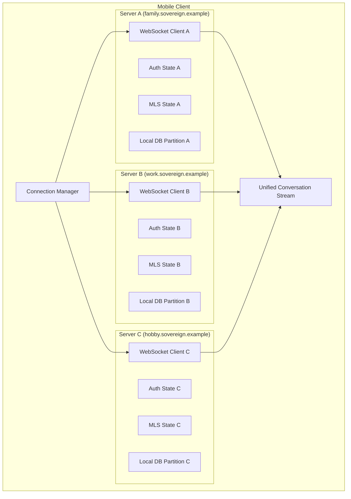
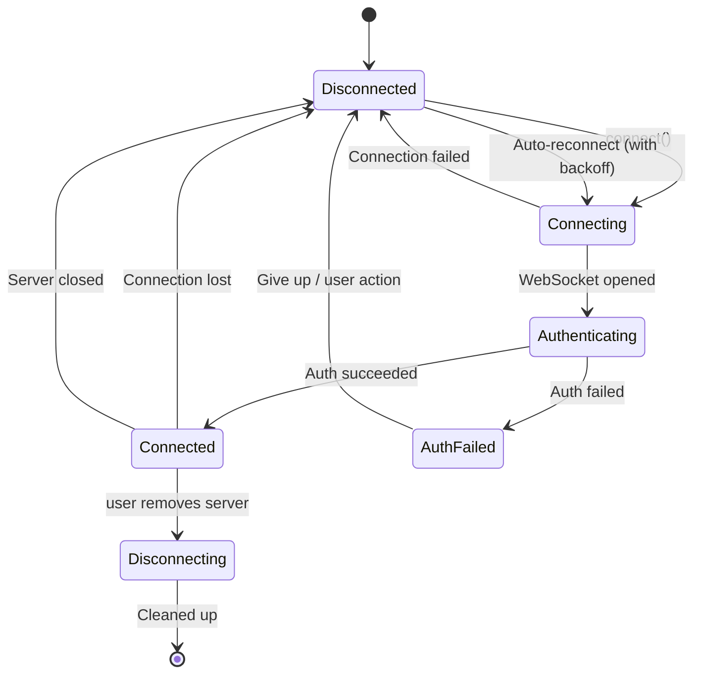

# RFC-0006: Multi-Server Client

- **Status**: Accepted
- **Author**: architect
- **Created**: 2026-02-16
- **Updated**: 2026-02-16
- **Review**: mobile-engineer

## Summary

This RFC defines how the Sovereign React Native mobile client manages simultaneous connections to multiple independent Sovereign servers. It covers per-server connection state management, credential isolation, unified conversation streams, server switching UX, storage partitioning, and offline/reconnection handling per server.

## Motivation

Sovereign is a self-hosted messaging application. Users may participate in multiple Sovereign instances:

- A personal server for family and friends.
- A workplace server managed by their employer.
- A community server for a hobby group.

Each Sovereign server is fully independent — different operators, different user databases, different encryption keys. The mobile client must treat each server as a separate trust domain while providing a unified, coherent user experience across all of them.

Without a multi-server design, users would need separate app installations (or profiles) for each server, which is a poor user experience and a barrier to adoption.

## Detailed Design

### Per-Server Connection Architecture

Each server connection is managed by an independent `ServerConnection` instance with its own state machine, credentials, WebSocket connection, and local storage partition.



### Per-Server Connection State Machine

Each server connection follows an independent state machine:



**State definitions:**

| State | Description | User-Visible Indicator |
|-------|-------------|----------------------|
| `Disconnected` | No active connection | Gray dot / "Offline" |
| `Connecting` | TCP/TLS handshake in progress | Yellow dot / "Connecting..." |
| `Authenticating` | WebSocket open, auth ceremony in progress | Yellow dot / "Authenticating..." |
| `Connected` | Fully authenticated, ready for messaging | Green dot / "Connected" |
| `AuthFailed` | Authentication failed (bad credential, server rejected) | Red dot / "Auth Failed" |
| `Disconnecting` | Gracefully shutting down (user removing server) | Gray dot / "Disconnecting..." |

Each server's state machine operates independently. Server A being disconnected does not affect Server B's connection.

### Credential Isolation

Credentials for each server are stored in completely separate keychain entries to prevent cross-server leakage.

**Keychain storage structure:**

```
Platform Keychain
├── sovereign.family.example.com
│   ├── passkey_credential_id    # WebAuthn credential ID
│   ├── session_token            # Current session token
│   └── server_config            # Server URL, display name, icon
├── sovereign.work.example.com
│   ├── passkey_credential_id
│   ├── session_token
│   └── server_config
└── sovereign.hobby.example.com
    ├── passkey_credential_id
    ├── session_token
    └── server_config
```

**Isolation rules:**
- Each server has its own WebAuthn credential (registered separately during server setup).
- Session tokens are never shared between servers.
- MLS private keys are per-server and per-group — there is no cross-server key material.
- If one server is compromised, it cannot access credentials or data from other servers.

### Local Storage Partitioning

The client's local database is partitioned by server to ensure complete data isolation:

```
App Data Directory
├── servers/
│   ├── sha256(family.sovereign.example.com)/
│   │   ├── messages.db          # SQLite: messages, conversations
│   │   ├── mls_state.db         # SQLite: MLS group states, keys
│   │   └── metadata.json        # Server display name, icon URL, etc.
│   ├── sha256(work.sovereign.example.com)/
│   │   ├── messages.db
│   │   ├── mls_state.db
│   │   └── metadata.json
│   └── sha256(hobby.sovereign.example.com)/
│       ├── messages.db
│       ├── mls_state.db
│       └── metadata.json
└── app_config.json              # Global app settings, server list
```

**Why separate databases per server (not tables):**
- Complete isolation: a bug in one server's query cannot leak data from another.
- Independent lifecycle: removing a server cleanly deletes its directory.
- Independent encryption: each database can use a different encryption key derived from the server's session material.

### Unified Conversation Stream

While data is isolated per-server, the user sees a unified experience:

**Conversation list (unified inbox):**
- All conversations from all connected servers are shown in a single list.
- Each conversation is tagged with its server (icon, color, or label).
- Conversations are sorted by most recent activity across all servers.
- The user can filter by server if desired.

**Data model for unified stream:**

```typescript
interface Conversation {
  id: string;                    // Unique within its server
  serverId: string;              // Which server this belongs to
  serverDisplayName: string;     // "Family", "Work", etc.
  groupId: string;               // MLS group ID
  title: string;                 // Conversation display name
  lastMessageTimestamp: number;  // For sorting across servers
  lastMessagePreview: string;    // Decrypted preview (local only)
  unreadCount: number;
}

// The unified conversation list merges from all servers
function getUnifiedConversations(): Conversation[] {
  const allConversations = connectedServers.flatMap(server =>
    server.localDb.getConversations().map(conv => ({
      ...conv,
      serverId: server.id,
      serverDisplayName: server.displayName,
    }))
  );
  return allConversations.sort((a, b) =>
    b.lastMessageTimestamp - a.lastMessageTimestamp
  );
}
```

### Server Setup Flow

Adding a new server to the client:

1. **Enter server URL**: User enters the Sovereign server's URL (e.g., `sovereign.example.com`).
2. **Server discovery**: Client fetches `https://sovereign.example.com/.well-known/sovereign.json` to retrieve server metadata (name, version, capabilities, registration policy).
3. **Registration or login**:
   - If the user has an account: WebAuthn authentication ceremony.
   - If the user needs an account: WebAuthn registration ceremony (subject to server's registration policy).
4. **Store credentials**: Session token and credential ID stored in platform keychain, partitioned by server domain.
5. **Initialize local storage**: Create local database partition for the new server.
6. **Connect**: Establish WebSocket connection and begin messaging.

**Server discovery response (`/.well-known/sovereign.json`):**

```json
{
  "name": "Family Chat",
  "version": "1.0.0",
  "websocket_url": "wss://sovereign.example.com/ws",
  "registration": "open",
  "icon_url": "https://sovereign.example.com/icon.png",
  "capabilities": ["mls", "passkey"]
}
```

### Server Switching UX

The client supports two primary interaction modes:

**1. Unified mode (default):**
- Single conversation list showing all servers.
- Server identity shown as a subtle badge on each conversation.
- Tapping a conversation opens it regardless of which server it belongs to.
- The connection manager transparently routes messages to the correct server.

**2. Server-focused mode:**
- User selects a specific server from a server picker (sidebar or top bar).
- Only conversations from that server are shown.
- Useful for users who prefer mental separation between contexts.

**Notification handling:**
- Push notifications include the server identity so the user knows which context the message is from.
- Notification grouping: messages are grouped by server, then by conversation.
- Tapping a notification opens the specific conversation on the specific server.

### Offline and Reconnection Per Server

Each server connection manages its own offline/reconnection behavior independently:

- **Independent reconnection**: If Server A's connection drops, only Server A enters the reconnection backoff loop. Server B and C continue operating normally.
- **Per-server offline queue**: Messages composed while a server is disconnected are queued locally in that server's storage partition. They are sent when the connection is re-established.
- **Per-server message gap detection**: On reconnection, each server connection independently requests missed messages since its last received `server_timestamp`.
- **Background connectivity**: When the app is backgrounded, connections may be dropped by the OS. On foregrounding, the connection manager re-establishes all server connections in parallel.

**Connection prioritization:**
- All servers are treated equally by default.
- If battery/bandwidth is constrained (e.g., low power mode), the client may reduce heartbeat frequency but maintains all connections.

### Server Removal

When a user removes a server:

1. Close the WebSocket connection gracefully.
2. Delete the session token from the platform keychain.
3. Delete the local storage partition (messages, MLS state).
4. Remove the server from the app configuration.
5. Update the unified conversation list.

The WebAuthn credential remains on the platform (passkeys are managed by the platform, not the app). The user can re-add the server later and authenticate with the same passkey.

## Security Considerations

- **Credential isolation**: Each server's credentials (passkey, session token) are stored in separate keychain entries. A compromised server cannot access credentials for other servers. The app enforces this isolation at the storage layer — there is no API to query another server's credentials.

- **No cross-server data leakage**: Messages, MLS state, and conversation metadata are stored in separate databases per server. There is no join, query, or data path that spans server boundaries. The unified conversation list is assembled in memory from separate queries to each server's database.

- **MLS isolation**: MLS group keys are per-server and per-group. A compromised server operator cannot use knowledge of their MLS group states to attack groups on another server. Each server's MLS groups operate in completely independent cryptographic contexts.

- **Server impersonation**: The client verifies the server's TLS certificate when connecting. A malicious network cannot impersonate a Sovereign server without a valid certificate for its domain. WebAuthn credentials are origin-bound, providing additional protection.

- **Malicious server**: A malicious server operator can see metadata (who messages whom, when, group membership) for their server. They cannot see message content (E2E encrypted) or data from other servers. Users should only add servers operated by entities they trust with this metadata.

- **Local data encryption**: Each server's local database should be encrypted with a key derived from the session material or device credentials. If the device is lost or stolen, local data is protected even if the device encryption is bypassed.

## Alternatives Considered

- **Single-server client**: Only support connecting to one server at a time. Simplest to implement but poor UX for users who participate in multiple Sovereign communities. This would force users to switch between servers manually, losing notifications and real-time updates from inactive servers.

- **App profiles / work profiles**: Use OS-level profiles (Android Work Profile, iOS app instances) for multi-server. This provides strong isolation but requires multiple app installations, duplicates storage, and is not available on all platforms.

- **Federation (server-to-server)**: Instead of the client connecting to multiple servers, have servers federate messages to each other (like Matrix or XMPP). This is architecturally very different — it requires server-to-server protocols, trust models, and identity federation. It may be a future direction but is far more complex than client-side multi-server. Rejected for the initial design.

- **Unified account across servers**: A single passkey that works across all Sovereign servers. This would require a shared identity system (contradicts the "each server is independent" design) or a scheme like DID (Decentralized Identifiers). Interesting for the future but adds significant complexity.

## Open Questions

- **Cross-server contacts**: If Alice knows Bob on both the family server and the work server, should the client detect that they are the same person and unify their contact entry? This requires a cross-server identity signal (e.g., same phone number, same email) which raises privacy concerns. Deferred.

- **Server-to-server migration**: If a user's server shuts down, can they migrate their data to another server? This requires an export/import mechanism and potentially re-encryption of MLS state. Deferred to a future RFC.

- **Maximum number of servers**: Is there a practical limit to how many servers a client can connect to simultaneously? Each server requires a WebSocket connection, background processing, and local storage. A reasonable default limit (e.g., 10 servers) should be tested empirically.

- **Push notification routing**: With multiple servers, how do push notifications route to the correct server connection in the app? Each server will need its own push notification registration, and the client must demultiplex incoming pushes by server. Deferred to the push notification RFC.

## References

- [RFC-0001: Project Architecture](./0001-project-architecture.md)
- [RFC-0002: WebSocket Protocol](./0002-websocket-protocol.md)
- [RFC-0004: Passkey Authentication](./0004-passkey-authentication.md)
- [ADR-0003: React Native for Mobile](../adrs/0003-react-native-for-mobile.md)
- [ADR-0006: WebSocket Transport](../adrs/0006-websocket-transport.md)
